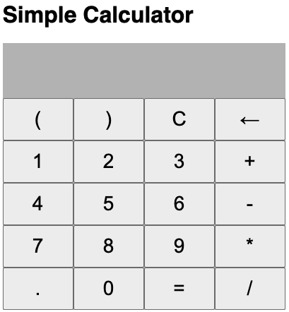

# Reagent Calculator
Simple calculator built using Clojurescript, shadow-cljs and Reagent



> Inspiration: https://github.com/niinpatel/calculator-react

## Run

``` shell
npm install

npm run watch
```

## Clean

``` shell
npm run clean
```

## Release

``` shell
npm run release
```
